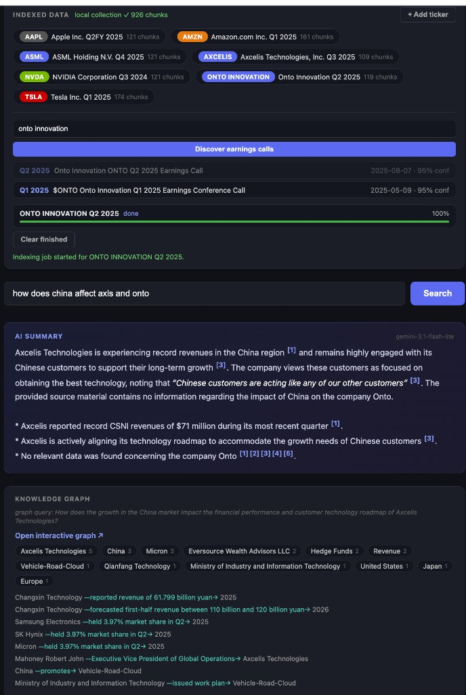
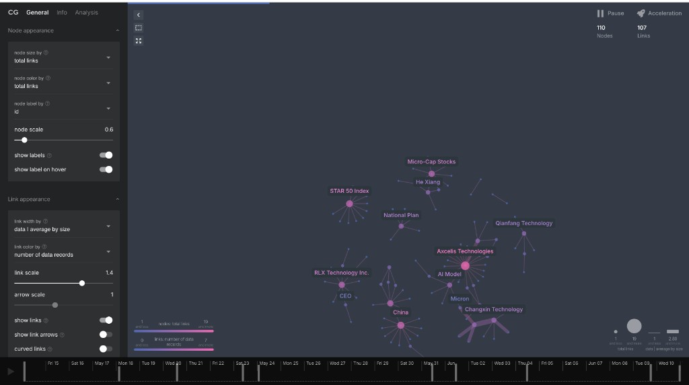

# Earnings Call MCP Server — Berlin Workshop (extended)

An **MCP (Model Context Protocol) server** that lets Claude search earnings call
transcripts by meaning, play back the exact audio moment, and see what was happening
in the news when management spoke.

Started as the Qdrant multimodal-search workshop project; since extended into a
self-contained system: a **local writable Qdrant** cloned from the read-only workshop
cluster, **13 MCP tools** (search, audio, news, knowledge graphs, discovery,
background indexing, collection lifecycle), and a web demo with an AI summary,
citations, and a live ingestion panel.

---

## Demo

The web demo: an ingestion panel (indexed tickers, ticker-only discovery, live
job progress), an AI summary with inline citations, and a per-query AskNews
knowledge graph with a HyDE-expanded graph query.



The "Open interactive graph" link opens the AskNews-hosted cosmograph
visualization of the entities and relationships around the query:



<details>
<summary>Watch the original workshop demo</summary>

[](https://youtu.be/R3icD5DWLHw)

▶️ **[Watch the demo on YouTube](https://youtu.be/R3icD5DWLHw)**

<video src="https://github.com/qdrant-labs/Multimodal-search-workshop/raw/main/docs/EarningsCalls.mp4" controls width="100%"></video>

> If the player doesn't load, [watch/download the demo video](docs/EarningsCalls.mp4).

</details>

---

## Architecture

```
DATA SOURCES & INGESTION
════════════════════════

  YouTube ─► yt-dlp ─► MP3 ─► faster-whisper (word timestamps) ─► pyannote diarization
                              (openai-whisper opt-in)            community-1 (3.1 fallback)
                                                                  + Gemini speaker ID
                                                                  │
                                                                  ▼
                          30-second chunks  { chunk_text , 30s audio clip }
                                     │                                  │
            ┌────────────────────────┘                                  └────────────────────────┐
            ▼                                                                                      ▼
  Gemini Embedding 2 ─► text vector (3072-d cosine)            Gemini Embedding 2 ─► audio vector (3072-d cosine)
            │            (embeds chunk_text)                    (embeds the audio clip DIRECTLY)                  │
            └────────────────────────┐                                  ┌────────────────────────┘
                                     ▼                                  ▼
                          named vectors { text, audio } in one shared multimodal space

QDRANT — TWO INSTANCES
══════════════════════

  ┌──────────────────────────────────┐   clone_collection /          ┌──────────────────────────────────┐
  │  Qdrant Cloud (read-only)        │   scripts/migrate_to_local.py │  LOCAL Qdrant (docker, writable) │
  │  shared workshop cluster         │ ────────────────────────────► │  localhost:6333                  │
  │  CLOUD_QDRANT_URL / _API_KEY     │   copies points + both        │  storage: data/qdrant_docker/    │
  │  collection: earnings_calls      │   vectors + indexes           │  + extra `quarter` keyword index │
  └──────────────────────────────────┘                               └────────────────┬─────────────────┘
                                                                                      │
                                          ┌───────────────────────────────────────────┘
                                          ▼
  ┌──────────────────────────────────────────────────────────────────────────────────┐
  │                        MCP Server  mcp_server/server.py                          │
  │                                                                                  │
  │  search · search_earnings, recommend_similar, list_tickers                       │
  │  media  · get_audio_clip                                                         │
  │  news   · get_news_context (AskNews + Firecrawl), get_news_graph (cosmograph)    │
  │  ingest · discover_earnings_calls, index_earnings_call,                          │
  │           get_indexing_jobs, cancel_indexing_job                                 │
  │  admin  · get_clone_status, clone_collection, delete_collection                  │
  └─────────┬──────────────────────────────────────────────┬────────────────────────┘
            │                                              │
  ┌─────────▼──────────────────┐               ┌──────────▼───────────────────────────┐
  │  Claude Desktop /          │               │  Web Demo  app.py  localhost:8000     │
  │  Claude Code (CLI)         │               │  AI summary with [n] citations        │
  │  "Index ASML's latest      │               │  + audio players + news cards         │
  │   earnings call"           │               │  + knowledge graph + ingest panel     │
  └────────────────────────────┘               └───────────────────────────────────────┘

BACKGROUND INDEXING JOBS  (mcp_server/jobs.py — add new calls at runtime)
═════════════════════════════════════════════════════════════════════════

  download (yt-dlp) ─► transcribe (Whisper+pyannote via ingest/02, or Gemini
  per-clip fallback) ─► embed (ingest/03 process_transcript ─► local Qdrant)
  state: data/jobs/{job_id}.json — progress %, heartbeats, resume, cancel
```

**Data flow for a query:**
1. User types a natural-language question
2. MCP server embeds it once with Gemini Embedding 2 (`models/gemini-embedding-2`, 3072 dims, multimodal)
3. Qdrant runs a **hybrid query**: the embedding is matched against BOTH named
   vectors (`text` and `audio` — same shared space) and the two rankings are
   fused with Reciprocal Rank Fusion. Optional `boost_recency` reranks
   client-side with an exponential half-life bonus (weight 0.25, 180-day half-life).
4. Server fetches a base64 audio clip per chunk (pre-sliced, or cut on demand with ffmpeg)
5. Server pulls [AskNews](https://asknews.app) context — cached per chunk, with a
   live `search_news` fallback (±7 days around the call) and Firecrawl page
   snapshots for articles that arrive without a summary
6. Claude (or the web UI) presents chunks, playable audio, and world context together

---

## MCP Tools

`mcp_server/server.py` is the **completed implementation** of the workshop exercises
(plus everything that grew beyond them). `mcp_server/server_solution.py` remains as
the original 4-tool workshop reference.

| Tool | What it does |
|---|---|
| `search_earnings` | Hybrid semantic search: query embedding vs. both `text` and `audio` vectors, RRF fusion, optional `ticker`/`date_range` filters and client-side `boost_recency` rerank |
| `get_audio_clip` | Base64 MP3 for a chunk — serves the pre-sliced clip, or cuts it from the full recording with ffmpeg (stream copy) and caches it |
| `get_news_context` | AskNews articles around the call: per-chunk cache → live `search_news` (±7 days) → Firecrawl snapshots for summary-less articles → written back to cache |
| `get_news_graph` | AskNews knowledge graph for a search query (+optional ticker/date range): top entities and relationships, plus a hosted cosmograph `visualize_url`; raw response cached. With the AI summary as `context` it runs a **HyDE-style** rewrite (Gemini) that resolves vague/anaphoric queries ("this", "the previous quarter") into a concrete, entity-anchored graph query |
| `recommend_similar` | "More like this" via Qdrant's native Recommend API (seed point as positive example, auto-excluded from results) |
| `list_tickers` | Indexed tickers with chunk counts and call metadata (via facet), plus any indexing jobs in flight |
| `discover_earnings_calls` | Find indexable calls for a ticker: Firecrawl YouTube search per year + AskNews historical coverage (sliced into ≤150-day windows) + Gemini 3.1 Flash-Lite normalization into deduplicated, dated, queue-ready candidates |
| `index_earnings_call` | Start a background indexing **job** for a new call (YouTube URL + metadata) against the local Qdrant |
| `get_indexing_jobs` | Job status: stage, percent, per-stage done/total counters, last log lines |
| `cancel_indexing_job` | Request cancellation; the worker stops at the next chunk boundary, completed work is kept for cheap resume |
| `get_clone_status` | Local collection vs. cloud source: existence, point counts, writability, in-sync flag |
| `clone_collection` | Clone (or force re-clone) `earnings_calls` from the read-only workshop cluster into the local Qdrant |
| `delete_collection` | Drop the local collection (requires `confirm=True`) so it can be re-cloned or rebuilt |

---

## Local vs. Cloud Qdrant

The shared workshop cluster is **read-only**. To index new calls you run a local
Qdrant in docker and clone the collection into it once:

```bash
docker run -d -p 6333:6333 -v ./data/qdrant_docker:/qdrant/storage qdrant/qdrant
python scripts/migrate_to_local.py     # or the clone_collection MCP tool,
                                       # or the web app's "Clone to local" button
```

- `QDRANT_URL` (default `http://localhost:6333`) is the **working target** all
  tools, the web app, and indexing jobs talk to.
- `CLOUD_QDRANT_URL` / `CLOUD_QDRANT_API_KEY` are only the **clone source**.
- The clone copies every point (payloads + both named vectors), recreates the
  payload indexes, and adds an extra `quarter` KEYWORD index on the local side.
- Write access is detected from the API key's JWT `access` claim, so tools
  refuse to index/clone/delete against a read-only target with a clear error.

---

## Background Indexing Jobs

`index_earnings_call` (or the web ingest panel) starts a job that runs the full
pipeline in a daemon thread, with state persisted to `data/jobs/{job_id}.json`
so any process (MCP server, web app, CLI) can observe it:

| Stage | What happens |
|---|---|
| `download` | yt-dlp pulls the call audio → `data/audio/{ticker}_{quarter}_{year}.mp3` + metadata sidecar; byte-level progress |
| `transcribe` | The same transcription + diarization + Gemini speaker-ID pipeline as `ingest/02` when `HF_TOKEN` (and pyannote + a whisper backend) are available — **faster-whisper** by default, **pyannote `community-1`** diarization (3.1 fallback); otherwise falls back to Gemini 3.1 Flash-Lite transcribing fixed 30s clips one by one. When diarization *is* available a transient failure fails the job (retryable) instead of silently downgrading to Gemini (`DIARIZATION_FALLBACK=1` opts back into the old behavior) |
| `embed` | Delegates to `ingest/03`'s `process_transcript` — identical point IDs (uuid5), payloads, and `text`+`audio` vectors as the original dataset — upserted into the local Qdrant. Gemini embedding calls run **in parallel** (bounded thread pool, `EMBED_CONCURRENCY`, default 8) for a ~7× speedup over the sequential path |

Robustness features (all in `mcp_server/jobs.py`):

- **Per-stage progress** — `stage`, `percent`, per-stage `done/total`, last 50 log lines; also logged to the console.
- **Heartbeats + orphan self-healing** — the worker beats every 30s; any reader
  reconciles jobs whose worker pid is dead or whose heartbeat is >120s old to
  `failed`, so a restarted process never sees a phantom "running" job.
- **Per-clip checkpointing & resume** — partial Gemini transcripts persist after
  every clip; re-adding the same call reuses the downloaded MP3, finished
  transcript chunks, and cached embeddings instead of starting over.
- **Cancellation** — `cancel_indexing_job` sets a flag the worker checks at chunk
  boundaries; artifacts are kept for a cheap rerun.
- **Dedup** — starting a job for a call that already has an active job returns
  the existing job; already-indexed quarters are rejected up front.

### Transcription & embedding tuning (env)

| Variable | Default | Effect |
|---|---|---|
| `TRANSCRIBE_BACKEND` | `faster-whisper` | `faster-whisper` (CTranslate2, int8) or `openai-whisper` |
| `WHISPER_MODEL` | `base` | Whisper model size |
| `WHISPER_DEVICE` | auto (CPU) | `cuda` / `mps` / `cpu`; MPS is wired up but slower than CPU for `base`, so CPU is the default |
| `DIARIZATION_MODEL` | `pyannote/speaker-diarization-community-1` | falls back to `…-3.1` if it can't load |
| `DIARIZATION_FALLBACK` | unset | `1` re-enables silent Gemini fallback when diarization is available but errors |
| `EMBED_CONCURRENCY` | `8` | parallel Gemini embedding workers in the embed stage |

> MPS note: on Apple Silicon, MPS helps pyannote but is *slower* than CPU for
> openai-whisper `base`. The real transcription win is `faster-whisper` (the
> default), benchmarked ~1.5× faster on a dense clip with equal/better accuracy.

---

## Web Demo (`app.py`)

FastAPI app at `http://localhost:8000`:

- **AI summary** — Gemini 3.1 Flash-Lite synthesizes the retrieved chunks into a
  cited answer; inline `[n]` citations are hotlinks to the matching result card,
  short verbatim quotes are styled inline.
- **Result cards** — transcript quote, ticker badge, score, audio player, and a
  scrollable AskNews context block (sentiment/bias badges, entities, expandable
  summaries). Audio, news, and the summary are fetched **in parallel** via a
  thread pool, so a cold news cache doesn't multiply latency.
- **Knowledge graph** — one block per search; the current AI summary is passed as
  context so a HyDE rewrite anchors the graph query to concrete entities, then it
  builds the AskNews graph on demand and links to the interactive cosmograph
  visualization (the resolved `graph query: …` is shown for transparency).
- **"Indexed data" panel** — clone state + "Clone to local" button, ticker chips
  with chunk counts, and ticker-only ingestion: type `MSFT` → discovery runs →
  clickable candidate calls → indexing jobs with live progress bars (polled
  every 2.5s) and a "Clear finished" button.

Panel endpoints: `/ingest/status`, `/ingest/clone`, `/ingest/discover`,
`/ingest/add`, `/ingest/jobs`, `/ingest/jobs/clear`, plus `/search` and `/graph`.

---

## What's Pre-built vs. Workshop Exercises

| Component | Status | Notes |
|---|---|---|
| Ingestion pipeline (`ingest/01–04`) | Pre-built | Run once to populate the DB (or let indexing jobs reuse it) |
| Qdrant collection | Pre-built via pipeline | 577 points across AAPL, AMZN, NVDA, TSLA — named vectors `text` + `audio` (3072-dim each) |
| AskNews cache (`data/asknews_cache/`) | Pre-built via pipeline | News context per transcription chunk; live-fetched and extended at runtime |
| Audio clips (`data/audio_clips/`) | Pre-built via pipeline | 30-second MP3 slices per point, also fed into the audio embedding |
| `mcp_server/embeddings.py` | Pre-built | Gemini Embedding 2 text-side embed + disk cache fallback |
| `mcp_server/server.py` | **Completed implementation** | All 13 tools — the workshop exercises plus discovery, jobs, graphs, and collection lifecycle |
| `mcp_server/server_solution.py` | Reference | Original 4-tool workshop solution |
| `mcp_server/jobs.py` | New | Background indexing job pipeline |
| `scripts/migrate_to_local.py` | New | Cloud → local collection clone |
| Web demo (`app.py`) | Extended | AI summary, citations, knowledge graph, ingest panel |
| CLI (`cli/setup_mcp.py`) | Pre-built | Registers the server with Claude Desktop — still works as-is |
| Browser agent (`browser_agent/`) | Pre-built | Bonus: Playwright + SEC EDGAR |

### Original workshop exercises

The exercises below were the workshop's 90-minute scope; `server.py` now contains
finished implementations of all of them (some with a different design than the
guide suggests — e.g. recency boosting is a client-side rerank rather than a
server-side `FormulaQuery`). See [`workshop/exercises.md`](workshop/exercises.md)
and [`workshop/implementation_guide.md`](workshop/implementation_guide.md).

| # | Exercise | Tool / File | What it's about |
|---|----------|-------------|-----------------|
| 1 | `search_earnings` | `server.py` | Embed a query, optional `ticker`/`date_range` filters, vector search over the named vectors |
| 2 | `get_audio_clip` | `server.py` | Retrieve a point, find/slice its `.mp3` clip, base64-encode it |
| 3 | `get_news_context` | `server.py` | Cached AskNews articles per chunk, with a live-fetch fallback |
| 4 | `recommend_similar` *(stretch)* | `server.py` | "More like this" via the Recommend API |
| 5 | Filterable HNSW + payload indexes *(stretch)* | `ingest/03_embed_and_index.py` | Why the collection uses `payload_m=16` and a DATETIME index on `date` |
| 6 | Time-based score boosting *(stretch)* | `server.py` | The `boost_recency` flag (implemented as an exponential half-life client-side rerank) |
| Bonus | `get_sec_filings` | `browser_agent/sec_scraper.py` | Playwright SEC EDGAR scraper as an extra MCP tool |

---

## Prerequisites

| Requirement | Notes |
|---|---|
| Python 3.12 | `python3 --version`; use `uv` to install if needed |
| Docker | For the local Qdrant instance |
| `GEMINI_API_KEY` | [aistudio.google.com](https://aistudio.google.com) — free tier. Used for query embedding, AI summary, transcription fallback, and discovery normalization |
| `CLOUD_QDRANT_URL` + `CLOUD_QDRANT_API_KEY` | Read-only workshop cluster (from your instructor) — the clone source |
| `ASKNEWS_API_KEY` | [AskNews](https://my.asknews.app) — live news context, discovery hints, knowledge graphs. For a free month ($250 value) use promo code `SEARCHWEEK` on the Spelunker plan at https://my.asknews.app/plans, then create an API key at https://my.asknews.app/en/settings/api-credentials. Without it, cached news still works |
| `FIRECRAWL_API_KEY` | [firecrawl.dev](https://firecrawl.dev) — web search for earnings-call discovery + page snapshots for news links missing a summary |
| `HF_TOKEN` | For real diarization in indexing jobs (Gemini transcription fallback otherwise). Accept terms at [pyannote/speaker-diarization-3.1](https://huggingface.co/pyannote/speaker-diarization-3.1), [pyannote/segmentation-3.0](https://huggingface.co/pyannote/segmentation-3.0), and [pyannote/speaker-diarization-community-1](https://huggingface.co/pyannote/speaker-diarization-community-1) |
| ffmpeg | Bundled via `static-ffmpeg` — no system install needed |

---

## Quick Start

```bash
# 1. Install dependencies
uv venv --python 3.12 && source .venv/bin/activate
uv pip install -r requirements.txt

# 2. Copy env template and fill in your API keys
cp .env.example .env   # GEMINI_API_KEY, CLOUD_QDRANT_URL/_API_KEY, ASKNEWS_API_KEY,
                       # FIRECRAWL_API_KEY, HF_TOKEN (QDRANT_URL already points at local docker)

# 3. Start a local writable Qdrant
docker run -d -p 6333:6333 -v ./data/qdrant_docker:/qdrant/storage qdrant/qdrant

# 4. Clone the workshop collection into it (one-off)
python scripts/migrate_to_local.py

# 5. Register the MCP server with Claude Desktop
python cli/setup_mcp.py install
python cli/setup_mcp.py status           # verify

# 6. Run the web demo
python app.py                            # http://localhost:8000
```

To rebuild the dataset from scratch instead of cloning, run the ingestion
pipeline (`ingest/01` → `04`) against the local Qdrant.

---

## Project Structure

```
asknews-hackaton/
├── README.md                         ← you are here
├── requirements.txt
├── setup.sh
├── .env.example                      ← copy to .env and fill in keys
├── app.py                            ← FastAPI web demo + ingest panel API
├── demo.py                           ← CLI demo with rich tables
├── data/
│   ├── audio/                        ← downloaded .mp3 files + metadata sidecars
│   ├── transcripts/                  ← transcript JSONs + point_map.json
│   ├── audio_clips/                  ← pre-sliced clips keyed by Qdrant point_id
│   ├── asknews_cache/                ← per-chunk news JSONs + graph_*.json caches
│   ├── jobs/                         ← indexing job records ({job_id}.json)
│   ├── qdrant_docker/                ← local Qdrant docker volume
│   └── embedding_cache_v2.json       ← text+audio embedding cache (sha256 keyed)
├── ingest/
│   ├── 01_download_audio.py          ← yt-dlp → MP3
│   ├── 01b_fetch_benzinga.py         ← Benzinga API → MP3 + transcript
│   ├── 02_transcribe_and_diarize.py  ← Whisper + pyannote diarization + Gemini speaker ID
│   ├── 03_embed_and_index.py         ← Gemini Embedding 2 (text + audio) → Qdrant upsert
│   └── 04_build_asknews_context.py   ← AskNews context → JSON cache
├── mcp_server/
│   ├── server.py                     ← completed MCP server (13 tools)
│   ├── server_solution.py            ← original workshop reference solution
│   ├── jobs.py                       ← background indexing job pipeline
│   └── embeddings.py                 ← embed_query() with disk cache fallback
├── scripts/
│   ├── migrate_to_local.py           ← clone cloud collection → local Qdrant
│   └── smoke_test.py
├── browser_agent/
│   └── sec_scraper.py                ← Playwright + SEC EDGAR (bonus exercise)
├── cli/
│   └── setup_mcp.py                  ← installs server into Claude Desktop config
└── workshop/
    ├── exercises.md                  ← original workshop guide
    └── implementation_guide.md
```

---

## Qdrant Payload Schema

Each point represents a ~30-second transcript chunk and carries TWO
named vectors in the same multimodal space produced by Gemini Embedding 2:

```json
{
  "id": "<uuid v5, stable per chunk>",
  "vector": {
    "text":  [3072 floats],   // gemini-embedding-2 over chunk_text
    "audio": [3072 floats]    // gemini-embedding-2 over the audio clip
  },
  "payload": {
    "ticker":      "TSLA",
    "company":     "Tesla Inc.",
    "quarter":     "Q1",
    "year":        2025,
    "chunk_index": 12,
    "chunk_text":  "We are navigating the tariff environment carefully...",
    "speaker":     "Elon Musk",
    "start_time":  342.1,
    "end_time":    372.8,
    "audio_file":  "tsla_q1_2025.mp3",
    "youtube_id":  "vs4cfyyMWhQ",
    "date":        "2025-04-22"
  }
}
```

Queries must specify which named vector to search (`using="text"` or
`using="audio"`); `search_earnings` queries both and fuses with RRF. The
collection uses filterable HNSW (`m=16, payload_m=16`) so heavily-filtered
searches stay fast.

**Payload indexes** (local collection):

| Field | Type | Used by |
|---|---|---|
| `ticker` | KEYWORD | `search_earnings(ticker=...)`, `list_tickers` facet |
| `date` | DATETIME | `search_earnings(date_range=...)` range filters |
| `year` | INTEGER | duplicate-call check before indexing |
| `speaker` | KEYWORD | speaker-filtered queries |
| `quarter` | KEYWORD | *local-only extra* (added by the clone) — quarter filters |

---

## Earnings Calls in the Base Dataset

The cloned collection ships with 577 chunks across 4 calls; anything you index
through the jobs pipeline is added on top.

| Ticker | Company | Quarter | Date | Chunks |
|---|---|---|---|---|
| NVDA | NVIDIA Corporation | Q3 FY2024 | 2023-11-21 | 121 |
| AAPL | Apple Inc. | Q2 FY2025 | 2025-04-30 | 121 |
| AMZN | Amazon.com Inc. | Q1 2025 | 2025-05-01 | 161 |
| TSLA | Tesla Inc. | Q1 2025 | 2025-04-22 | 174 |

---

## Test Questions for Claude

Once the server is running and registered:

```
Which CEOs mentioned tariffs in Q1 2025 earnings calls?
What did NVDA say about data center demand in Q3 2024?
How did Apple describe the impact of tariffs on its supply chain?
What was Amazon's tone on consumer spending in Q1 2025?
Find all mentions of AI infrastructure investment
Compare how TSLA and AAPL described macroeconomic uncertainty
Play the audio for that last transcript chunk
Find other earnings chunks similar to that one
Build a knowledge graph of the news around NVIDIA's data center demand
What earnings calls can you find for MSFT? Index the latest one.
How is that indexing job going?
```

---

## Troubleshooting

**MCP server not appearing in Claude:**
```bash
python cli/setup_mcp.py install
# then restart Claude Desktop (Cmd+Q, reopen)
```

**Qdrant connection errors:**
- Is the docker container running? `curl http://localhost:6333/collections`
- Check `QDRANT_URL` in `.env` (leave `QDRANT_API_KEY` empty for local docker)
- Embedded fallback without docker: set `QDRANT_PATH=./data/qdrant_storage` and
  leave `QDRANT_URL` empty (single-process only — the web app and MCP server
  can't share it)

**"read-only" errors when indexing/cloning/deleting:**
- You're pointed at the shared workshop cluster. Set `QDRANT_URL` to the local
  docker instance and keep the workshop credentials in `CLOUD_QDRANT_URL/_API_KEY`.

**Embedding errors:**
- Check `GEMINI_API_KEY` in `.env`
- `data/embedding_cache_v2.json` provides offline fallback once populated
  (caches both text and audio vectors, sha256 keyed)

**Audio not playing:**
- Check that `data/audio_clips/` contains `.mp3` files
- If a clip is missing, `get_audio_clip` slices it on demand from `data/audio/`
  with ffmpeg (bundled via `static-ffmpeg`)

**Indexing job stuck or "interrupted (process restarted)":**
- Jobs run inside the process that started them; if that process dies, the job
  is auto-marked failed on the next status read. Start the same call again — it
  resumes from the downloaded audio, partial transcript, and cached embeddings.
- Whisper on CPU can take tens of minutes for a full call; the `transcribe`
  stage logs sub-steps and keeps a heartbeat so it isn't mistaken for a hang.

**Discovery returns nothing:**
- `discover_earnings_calls` needs `FIRECRAWL_API_KEY` for the YouTube search;
  `ASKNEWS_API_KEY` improves date accuracy, and `GEMINI_API_KEY` enables the
  candidate cleanup pass (regex fallback otherwise).

**Whisper takes too long (if re-transcribing):**
- In `ingest/02_transcribe_and_diarize.py` change `whisper.load_model("base")` to `"tiny"` for speed
